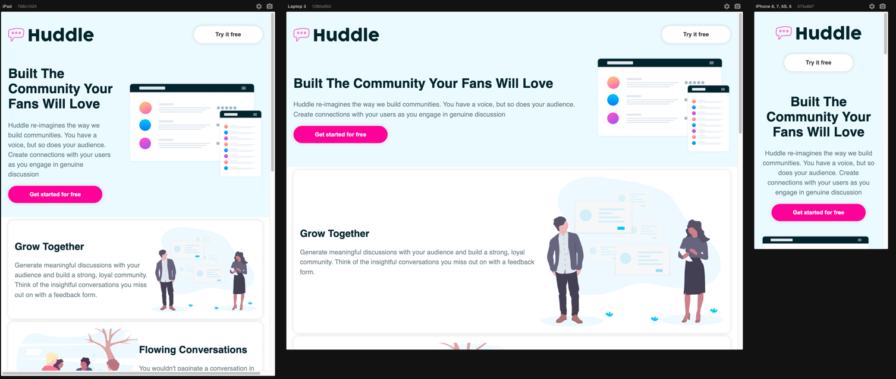

# Frontend Mentor - Product preview card component solution

This is a solution to the [Product preview card component challenge on Frontend Mentor](https://www.frontendmentor.io/challenges/product-preview-card-component-GO7UmttRfa). Frontend Mentor challenges help you improve your coding skills by building realistic projects.

## Table of content
- [Overview](#overview)
  - [The challenge](#the-challenge)
  - [Screenshot](#screenshot)
  - [Links](#links)
  - [My process](#my-process)
      - [Built with](#built-with)
      - [What I learned](#what-i-learned)
      - [Continued development](#continued-development)
      - [Useful resources](#useful-resources)
  - [Author](#author)
  - [Acknowledgments](#acknowledgments)

## Overview
### The challenge
My challenge was to build a preview card component and got it looking as close to the design as possible.
I used Next.js and Vercel.
Goals/ User should be able to:

- View the optimal layout depending on their device's screen size
- See hover and focus states for interactive elements

I learned to use the design and make ist responsive depending the device screen.
Also I used hover and focus states for interactive elements

### Screenshot

### Links
https://huddle-puce.vercel.app/
### My process
At first i built the different components at last i have to solve the css tricks 
### Built with
i built this challenge with Next.js and plain css, i try to use reusable code structure
### What i learned
i learned to use display:flex and order:1 or 2 in different divs to make another order.
Also i learned the functionality of row-reverse and layout={id % 2 === 0 && 'row-reverse'}

### Author
JpunktWpunkt
